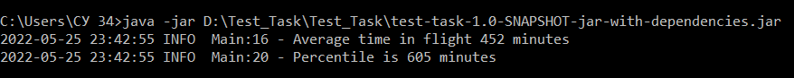

Test_Task

Напишите программу на языке программирования java, которая прочитает файл tikets.json и рассчитает:
* среднее время полёта между городами Владивосток и Тель-Авив;
* 90-й процентиль времени полёта между городами Владивосток и Тель-Авив.

Программа должна быть представлена из командной строки Linux, результаты должны быть представлены в текстовом виде.

